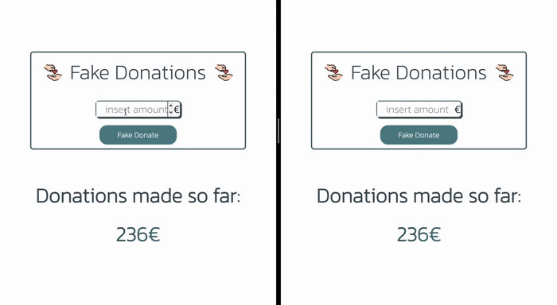

# Live Chat Server + Client

A fake donations webapp that allows you to introduce a value to update the total donations amount. This total is updated in real time with the help of the pubsub pattern.

## Tech Stack
 - **Pubsub**: Redis (ioredis)
 - **BE**: Nodejs + TypeScript + web sockets
 - **Webapp**: React + TypeScript + web sockets
 - **Containerization**: Docker

## Preview


## Installation

Use [docker compose](https://docs.docker.com/compose/) to install and run the app.

```bash
docker-compose build
```
## Run

```bash
docker-compose up
```

**_NOTE: the app will be accessible on localhost:3000_**